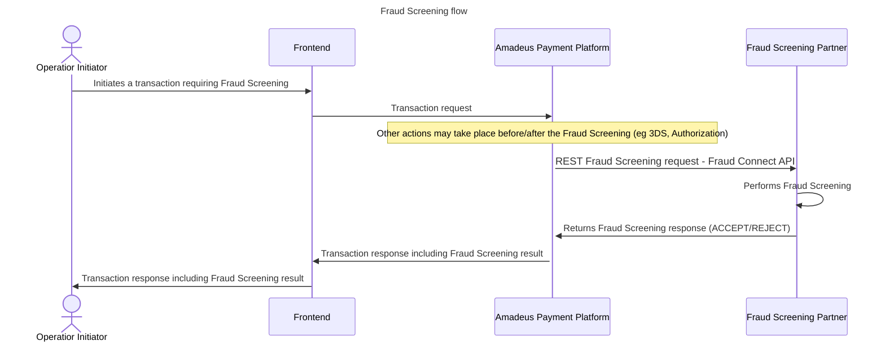

# Fraud Connect API User Guide 
## **Purpose and Scope**

This user guide describes the payment features and functionalities offered by the Outpayce Connect API for Fraud Screening. The scope of this user guide concerns only Payments done by Credit Card method of payment.

This document includes detailed descriptions of all fields currently supported in Fraud Connect API as well as detailed examples and scenarios of the payment operations currently supported. The aim of this document is to enhance and supplement the existing swagger specification.

It is recommended to read the data objects/elements together with the swagger specification to understand which data to provide, how and when to provide it. Tables are used in this specification with rows holding the data objects/elements while the applicability columns indicating whether the data element/object is applicable for specific capability.

Applicability is indicated using the following notions:

• **“O”** - Optional:   &nbsp; &nbsp;  &nbsp;&nbsp;&nbsp;&nbsp;&nbsp;   *Not usually needed to perform a payment transaction but will be added if available.* 
 
• **Important note on fields in this connect API**: The grammer does not enforce any mandatory fields, they will always all be optional. However to be able to produce a fraud screening result it is implied that some fields will, in practice, be considered mandatory. And these fields shall be **partner specific**. Thus, this is to be determined by each partner implementing this API. **Any fields they consider mandatory will have to be enforced by their system, and if missing shall return an appropriate HTTP functional error and description.** So for the sake of this documentation no fields will be marked as mandatory, but in the associated postman test collection for certification, some fields will be considered mandatory for the purpose of having functional error cases described, if not for anything else.

## API Basics
Fraud Connect API is a RESTful Service and its endpoints will be called using **HTTP PUT** requests formatted as JSON.

## Environment and URLs
Outpayce provides up to two different environments. One environments for testing/sandbox and for validation purposes, as well as a Production environment. 
From testing phase to Go Live in Production, we will use different urls in test and production that follow a specific format for the operation supported by Fraud Connect API (Fraud Screening). <br> The url structure is **_https://{your-host-name}/outpayce/v1/fraud-screening/{PRI}_** where: 


 
_**- {your-host-name}**_ is the base URL you will provide alongside the endpoint you are using to host the API on your side.<br>
_**- {PRI}**_ is the "payment record identifier" which is a unique identifier in Amadeus payment systems which refers to a singular payment transaction and all related operations (3DS, Fraud, Authorization, etc).
 <br>


#### URL Examples
 
Payment Operations full URL in test environment :  
###### https://{your-host-name_in-test}/outpayce/v1/fraud-screening/{operationId}

Payment Operations full URL in production environment : 
###### https://{your-host-name_in-production}/outpayce/v1/fraud-screening/{operationId}


## API versioning 

Fraud Connect API employs versioning. In any event, Outpayce will notify you of a new release of Fraud Connect API. If the newly released version is backwards compatible, you will have to update your version to accomodate for the new changes. If a major release is not backwards compatible, you will have to apply for a new certification process to account for the new major changes. Minor adjustements that are classified as patches, such as text modifications will not prompt a new certification process or API update.

## **Fraud Connect API supported capabilities:**

•	Fraud Screening <br>

  
## 1 Fraud Screening Operation



### 1.1 Fraud Screening

#### 1.1.2 Request fields

#### 1.1.2.1 Request Body - fields
Important Note:
All fields in this API are optional. 
The integration must be resilient to the addition of future fields and remain fully functional.

| Object/field name | Applicability | Comments                                                      | Expected format |
|-------------------|---------------|---------------------------------------------------------------|------------------|
| id                | O  | Amadeus operation identifier.  This identifier is generated by Amadeus Payment Platform and uniquely represents this operation.     | string           |
| paymentMerchantReference | O             | Identifier of a previous Authorization operation belonging to the same      | string           |
| timestamp         | O  | Datetime of the operation.                                      | string           |
| amount     | O | Operation amount | object |
| amount.value | O | The value of the amount. | string |
| amount.currencyCode | O | Indicate the currency of the provided amount. |String, <br> *minLength: 3, maxLength: 3* <br> |
| method            | O  | Method of Payment requested at authorization time.               | String Enum:  Card   |
| card              | O  | The payment card is a particular payment instrument. | Object           |
| card.vendorCode   | O | Upper case key representing the brand of the payment card chosen by the payer to process that payment transaction | string |
| card.holder       | O | Describe the holder of the payment instrument. | object |
| card.holder.language | O | Indicate the payment-instrument holder's language. | string |
| card.holder.email | O | Indicate the payment-instrument holder's email address. | string |
| card.holder.billingAddress | O | Indicate the payment-instrument holder's postal address. | object |
| card.holder.billingAddress.countryCode | O | Indicate the payment-instrument holder's country. | string |
| card.holder.billingAddress.cityName | O | Indicate the payment-instrument holder's city name. | string |
| card.holder.billingAddress.postalCode | O | Indicate the payment-instrument holder's postal code. | string |
| card.holder.contacts | O | A contact refers to the information that can be used to reach a person, a company or an organization. | array |
| card.holder.contacts[] | O | A contact refers to the information that can be used to reach a person, a company or an organization. | object |
| card.holder.contacts[].phone | O | Phone information. | object |
| card.holder.contacts[].phone.text | O | String containing the full phone number | string |
| card.holder.name | O |  | object |
| card.holder.name.lastName | O |  | string |
| card.holder.name.firstName | O |  | string |
| operationContext | O |  | object |
| operationContext.links | O |  | array |
| operationContext.links[] | O |  | object |
| operationContext.links[].rel | O | Relation of the link (eg. parent, resumption, FAQ). | string |
| operationContext.links[].href | O | Absolute or relative URL. | string |
| operationContext.threeDomainSecure | O | Operation 3-Domain Secure information. | object |
| operationContext.threeDomainSecure.collectionIndicator | O | UCAF collection indicator value. | string |
| operationContext.threeDomainSecure.cavvAlgorithm | O | CAVV Algorithm, required for some schemes. | string |
| operationContext.threeDomainSecure.aav | O | UCAF Accountholder Authentication Value. | string |
| operationContext.threeDomainSecure.aevv | O | Base64-encoded American Express Verification Value. | string |
| operationContext.threeDomainSecure.cavv | O | Base64-encoded Cardholder Authentication Verification Value. | string |
| operationContext.threeDomainSecure.eci | O | Computed e-commerce indicator. | string |
| operationContext.threeDomainSecure.transStatus | O | 3-D Secure 2.x (or later) Final Authentication Result. | string |
| operationContext.threeDomainSecure.xid | O | Base64-encoded 3-D Secure transaction identifier. | string |
| operationContext.threeDomainSecure.dsTransactionId | O | 3-D Secure 2.x (or later) Directory Server Transaction Identifier. | string |
| operationContext.threeDomainSecure.version | O | 3-D Secure protocol version. | string |
| operationContext.device | O |  | object |
| operationContext.device.id | O |  | string |
| operationContext.device.activeWebBrowser | O | Web browser information | object |
| operationContext.device.activeWebBrowser.userAgentHeader | O | Conveys the User-Agent header information sent by the browser at query time. | string |
| operationContext.device.activeWebBrowser.acceptHeader | O | Conveys the Accept header information sent by the browser at query time. | string |
| operationContext.device.network | O | Information about the network | object |
| operationContext.device.network.ipAddress | O | Value of the IP (Internet Protocol) address, versions 4 or 6. | string |
| pointOfInteraction | O | Characteristics and environmental information of a conceptually and individually identifiable point of business interaction leading to some operations. | object |
| pointOfInteraction.participatingPaymentTerminal | O | Payment terminal, device interfacing with payment cards to provide a set of different financial services. | object |
| pointOfInteraction.participatingPaymentTerminal.deviceReference | O | Reference identifying the payment terminal. | string |
| pointOfInteraction.operatingEnvironment | O | Operating Environment of a given Point of Interaction. | object |
| pointOfInteraction.operatingEnvironment.deliveryTypesOfGoods | O | Types of goods delivered through this Point of Business. | array |
| pointOfInteraction.operatingEnvironment.deliveryTypesOfGoods[] | O |  | string |
| pointOfInteraction.operatingEnvironment.cardPresence | O | Qualification of the Point of Business as *Card Present* or *Card Not Present* environment. | enum |
| pointOfInteraction.operatingEnvironment.holderInteractionMode | O | Primary mode of interaction with the payment instrument holder that this Point of Business provides. | enum |
| pointOfInteraction.operatingEnvironment.hasOnlineCapacity | O | Indicator of the capacity of the Point Of Business to use the network connectivity to synchronously communicate with the processor. | boolean |
| pointOfInteraction.operatingEnvironment.hasOfflineCapacity | O | Indicator of the capacity of the Point Of Business to operate autonomously without a direct connectivity with the processor. | boolean |
| pointOfInteraction.operatingEnvironment.vicinity | O | Positioning information with regards to potential premises of the Point of Business. | enum |
| pointOfInteraction.operatingEnvironment.supervisedBy | O | Information about which category of stakeholder is accountable, supervising the Point of Business. | enum |
| pointOfInteraction.operatingEnvironment.isAttended | O | Indicator of whether the Point of Business is or not attended. | boolean |
| pointOfInteraction.location | O | Description of a particular point or place in physical space | object |
| pointOfInteraction.location.address | O | Address information | object |
| pointOfInteraction.location.address.countryCode | O | ISO 3166-1 country code | string |
| pointOfInteraction.location.address.lines | O | Line 1 = Street address, Line 2 = Apartment, suite, unit, building, floor, etc | array |
| pointOfInteraction.location.address.lines[] | O |  | string |
| pointOfInteraction.location.address.postalCode | O | Example: 74130 | string |
| pointOfInteraction.location.address.stateCode | O | State code (two character standard IATA state code) | string |
| pointOfInteraction.location.address.state | O | State, province or country name | string |
| pointOfInteraction.location.subtype | O | Location sub-type (e.g. market, division, airport, port, rail-station, restaurant, atm...) | string |
| pointOfInteraction.location.name | O | Label associated to the location (e.g. Eiffel Tower, Madison Square) | string |
| pointOfInteraction.referenceOwner | O | Owner/Issuer of the type of reference used to reference this point of business interaction. | string |
| pointOfInteraction.referenceType | O | Type of reference used to reference this point of business interaction. | string |
| pointOfInteraction.reference | O | Reference of the point of business interaction. | string |
| purposeOfOperation | O | Purpose of the payment operation (sales, donation,...) | object |
| purposeOfOperation.sales | O |  | array |
| purposeOfOperation.sales[] | O | Sales summary information, should itemized information be also necessary, then this level of detail will be transported by composition of SalesSummaryItem instances. | object |
| purposeOfOperation.sales[].reference | O | Reference identifying the sales. | string |
| purposeOfOperation.sales[].referenceType | O | Type of reference identifying the sales. | string |
| purposeOfOperation.sales[].referenceOwner | O | Owner of the reference type. | string |
| purposeOfOperation.sales[].salesItems | O | Sales items information. | array |
| purposeOfOperation.sales[].salesItems[] | O | Sales summary itemized information, usually as a collection of children of a SalesSummary instance. | object |
| purposeOfOperation.sales[].salesItems[].category | O | Category best qualifying the sales item. | enum |
| purposeOfOperation.sales[].salesItems[].discounts | O | Discounts associated to the sales item. | array |
| purposeOfOperation.sales[].salesItems[].discounts[] | O |  | object |
| purposeOfOperation.sales[].salesItems[].discounts[].code | O | Discount code is a parameter that allow to target specific price or apply a specific discount (percent or flat amount) to a public or private price depending of the nature of the passenger. | string |
| purposeOfOperation.sales[].salesItems[].discounts[].amount | O | Monetary amount, formatted as it should be presented to an end user. | string |
| purposeOfOperation.sales[].salesItems[].discounts[].currencyCode | O | Indicate the currency of the provided amount (following ISO 4217). | string |
| purposeOfOperation.sales[].salesItems[].flightSalesDetails | O | Flight detailed item description as a sales summary item. | object |
| purposeOfOperation.sales[].salesItems[].flightSalesDetails.flightLegs | O |  | array |
| purposeOfOperation.sales[].salesItems[].flightSalesDetails.flightLegs[] | O | Flight itinerary details associated to a given passenger as sales summary flight details at flight segment level. | object |
| purposeOfOperation.sales[].salesItems[].flightSalesDetails.flightLegs[].fareBasisCode | O | Airline fare basis code identifying a fare type. | string |
| purposeOfOperation.sales[].salesItems[].flightSalesDetails.flightLegs[].localArrivalTime | O | Local date and time of the scheduled arrival, compliant with ISO8601. | string |
| purposeOfOperation.sales[].salesItems[].flightSalesDetails.flightLegs[].arrivalTime | O | UTC date and time of the scheduled arrival, compliant with ISO8601. | string |
| purposeOfOperation.sales[].salesItems[].flightSalesDetails.flightLegs[].arrivalAirportCode | O | IATA 3-letter code representing the airport of arrival of that flight leg. | string |
| purposeOfOperation.sales[].salesItems[].flightSalesDetails.flightLegs[].localDepartureTime | O | Local date and time of the scheduled departure, compliant with ISO8601. | string |
| purposeOfOperation.sales[].salesItems[].flightSalesDetails.flightLegs[].departureTime | O | UTC date and time of the scheduled departure, compliant with ISO8601. | string |
| purposeOfOperation.sales[].salesItems[].flightSalesDetails.flightLegs[].departureAirportCode | O | IATA 3-letter code representing the airport of departure of that flight leg. | string |
| purposeOfOperation.sales[].salesItems[].flightSalesDetails.flightLegs[].carrierCode | O | IATA code of the carrier in charge of that flight segment. | string |
| purposeOfOperation.sales[].salesItems[].flightSalesDetails.flightLegs[].travelDate | O | Day when travel over that segment begins. | string |
| purposeOfOperation.sales[].salesItems[].flightSalesDetails.flightLegs[].couponNumber | O | Coupon number. | string |
| purposeOfOperation.sales[].salesItems[].flightSalesDetails.flightLegs[].flightNumber | O | Flight number associated to the carrier in charge of that flight segment. | string |
| purposeOfOperation.sales[].salesItems[].flightSalesDetails.flightLegs[].serviceClass | O | Reference identifying the class of travel and included services (with their conditions and benefits) sold. | string |
| purposeOfOperation.sales[].salesItems[].flightSalesDetails.issuingCarrierCode | O | IATA code of the validating carrier. | string |
| purposeOfOperation.sales[].salesItems[].flightSalesDetails.travelAgencyCode | O | Code identifying the travel agency resposible for this sales.. | string |
| purposeOfOperation.sales[].salesItems[].flightSalesDetails.travelAgencyName | O | Name of the travel agency resposible for this sales. | string |
| purposeOfOperation.sales[].salesItems[].flightSalesDetails.issuedDate | O | Date of issuance of the ticket. | string |
| purposeOfOperation.sales[].salesItems[].flightSalesDetails.reservationSystem | O | Reservation System. | string |
| purposeOfOperation.sales[].salesItems[].flightSalesDetails.passenger | O | Passenger of the flight. | object |
| purposeOfOperation.sales[].salesItems[].flightSalesDetails.passenger.name | O | Description of the name of a physical person | object |
| purposeOfOperation.sales[].salesItems[].flightSalesDetails.passenger.name.firstName | O | First name. | string |
| purposeOfOperation.sales[].salesItems[].flightSalesDetails.passenger.name.lastName | O | Last name. | string |
| purposeOfOperation.sales[].salesItems[].flightSalesDetails.passenger.flightPassengerType | O | Specifies flight passenger type | enum |
| purposeOfOperation.sales[].salesItems[].flightSalesDetails.ticketNumber | O | Ticket number of the flight. | string |
| purposeOfOperation.sales[].salesItems[].flightSalesDetails.reservationNumber | O | Reservation number of the flight, usually assigned at booking time. | string |
| purposeOfOperation.sales[].salesItems[].flightSalesDetails.passengerRoute | O | List of IATA airport codes participating as segment touchpoints chronologically sorted. | array |
| purposeOfOperation.sales[].salesItems[].flightSalesDetails.passengerRoute[] | O |  | string |
| purposeOfOperation.validUntil | O | Date and time until which the object of the payment (sales) is valid. After this limit, the sales content is released and the sale process has to be started over. | string |


#### 1.1.2.2 Request Headers 

| Object/field name | Applicability | Comments                                                      | Expected format |
|-------------------|---------------|---------------------------------------------------------------|------------------|
| Content-Type | M | Standard HTTP header that indicates the media type of the body content  | string |
| x-api-key | M | API KEY key previously obtained through the provider system and stored at the FRDPARAM rule | string |
| merchant-id | M | Upper case short key uniquely identifying the merchant | string |


##### Fraud Screening request full example:

```
  PUT https://{your-host-name}/outpayce/v1/fraud-screening/{fraudScreeningId} HTTP/1.1
  Content-Type: application/vnd.amadeus+json
  x-api-key: <API key agreed with Partner>
  merchant-id: 7X
  ...
{
    "data": {
        "id": "51722527428",
        "amount": {
            "currencyCode": "GBP",
            "value": "348.74"
        },
        "card": {
            "cardNumber": "5351429999990539",
            "expiryDate": "2027-09",
            "holderName": "Marcos Erdman",
            "holder": {
                "billingAddress": {
                    "cityName": "Reingerborough",
                    "countryCode": "PT",
                    "postalCode": "11203",
                    "lines": ["917 Cartwright Corners"],
                    "stateCode": "AZ"
                },
                "contacts": [{
                        "phone": {
                            "text": "608-537-0863"
                        }
                    }
                ],
                "email": "ACCEPT@FRAUDTEST.COM",
                "language": "EN",
                "identityDocument": {
                    "documentType": "PASSPORT",
                    "number": "0Y96JKR8YVKL",
                    "issuanceCountry": "PT"
                }
            },
            "vendorCode": "CA"
        },
        "method": "CARD",
        "operationContext": {
            "device": {
                "activeWebBrowser": {
                    "acceptHeader": "json",
                    "ietfLanguageTag": "EN",
                    "userAgentHeader": "Chrome/130.0.0.0"
                },
                "network": {
                    "ipAddress": "48.217.134.183"
                },
                "id": "4b20a15a-5fab-447a-9ec0-ea65da676be6",
                "deviceFingerprint": {
                    "value": "40fe5533-693d-4a13-bd18-ca12d7f1823a"
                }
            },
            "links": [{
                    "href": "https://amadeus.com_sandbox",
                    "rel": "merchantURL"
                }
            ],
            "threeDomainSecure": {
                "eci": "02",
                "cavv": "kAN1IbVpyeJJ1nPp97bwwzVhVg9n",
                "xid": "AJkBBkhgQQAAAE4gSEJydQAAAAA",
                "version": "2.2.0",
                "dsTransactionId": "33fdbf1a-02ed-446b-8ca3-98a62af1b870",
                "transStatus": "Y"
            },
            "interactionCondition": "ECOMMERCE"
        },
        "paymentMerchantReference": "3FKKG52ELV9DZCTEXCF8",
        "pointOfInteraction": {
            "location": {
                "address": {
                    "countryCode": "PT",
                    "postalCode": "11203",
                    "lines": ["13288 Adolf Junction"],
                    "stateCode": "AZ",
                    "state": "Azores"
                },
                "name": "Best Agency Ever",
                "subtype": "travelAgency"
            },
            "operatingEnvironment": {
                "holderInteractionMode": "ECOMMERCE"
            },
            "reference": "NCEBA08AA",
            "referenceType": "officeId",
            "referenceOwner": "7X"
        },
        "purposeOfOperation": {
            "sales": [{
                    "reference": "QNE511",
                    "referenceType": "PNR",
                    "salesItems": [{
                            "category": "FLIGHT",
                            "discounts": [{
                                "code": "BLACKFRIDAY",
                                "amount": "99.99",
                                "currencyCode": "GBP"
                            }],
                            "flightSalesDetails": {
                                "flightLegs": [{
                                        "arrivalAirportCode": "MUC",
                                        "arrivalTime": "2026-12-22T21:45:00Z",
                                        "carrierCode": "7X",
                                        "departureAirportCode": "CDG",
                                        "departureTime": "2026-12-21T19:35:00Z",
                                        "flightNumber": "6204",
                                        "localArrivalTime": "2026-12-22T21:45:00Z",
                                        "localDepartureTime": "2026-12-21T19:35:00Z",
                                        "serviceClass": "Y"
                                    }
                                ],
                                "issuingCarrierCode": "7X",
                                "issuedDate": "2026-01-22T10:14:13Z",
                                "passenger": {
                                    "name": {
                                        "firstName": "Monte",
                                        "lastName": "Lemke"
                                    },
                                    "dateOfBirth": "1985-11-15",
                                    "flightPassengerType": "ADULT",
                                    "loyaltyMemberships": [{
                                            "membershipId": "12781219",
                                            "activeTier": {
                                                "level": "quantifying"
                                            },
                                            "enrollment": {
                                                "date": "2003-11-15"
                                            }
                                        }
                                    ]
                                },
                                "ticketNumber": "990-878-2808",
                                "reservationNumber": "QNE511",
                                "passengerRoute": ["CDG", "MUC"],
                                "travelAgencyCode": "1234",
                                "travelAgencyName": "Best Agency Ever"
                            }
                        }
                    ]
                }
            ]
        },
        "timestamp": "2026-01-22T10:14:13Z"
    }
}  
```


#### 1.1.3 Response fields
| Object/field name | Applicability | Comments | Expected format |
|---------------------|---------------|---------------------------------------------------------------|------------------| 
| reference | M | Resource reference or unique identifier of partner | String | 
| paymentMerchantReference | O | Operation merchant reference (also identified as MRF in other Amadeus payment applications) | String| 
| timestamp | O| Datetime of the operation. | string |
| recomendedActions | M| Object containing recomended actions and additional data | object|
| recommendedActions.actionCode | M | Recommended action returned by the fraud partner as a result of the fraud screening operation | string |
| recommendedActions.presentCreditCard | O |Present credit card (PCC) indicator | string | 
| externalScore | O | Total fraud screening score provided by the fraud partner | string |

The table above contains the minimum amount of data Outpayce expects to receive in the response. Without at least the fields tagged as **Mandatory**, Outpayce will not be able to process the Reversal response. <br>

##### Fraud Screening succesful response example:

```
  HTTP/1.1 201 Created
  Content-Type: application/vnd.amadeus+json
  ...
{
  "data": {
    "reference": "req_6a037374-3971-4159-a6ea-a10cb40fded2",
    "paymentMerchantReference": "3FKKG52ELV9DZCTEXCF8",
    "timestamp": "2022-06-22T23:59:55Z",
	"recommendedActions": {
	  "actionCode": "ACCEPT",
	  "presentCreditCard": false
	},
	"externalScore": "500"
  }
}
```

##### Fraud Screening response example:

```
  HTTP/1.1 201 Created
  Content-Type: application/vnd.amadeus+json
  ...
{
  "data": {
    "reference": "req_6a037374-3971-4159-a6ea-a10cb40fded3",
    "paymentMerchantReference": "3FKKG52ELV9DZCTEXCF9",
    "timestamp": "2022-06-23T05:16:55Z",
	"recommendedActions": {
	  "actionCode": "REJECT",
	  "presentCreditCard": false
	},
	"externalScore": "300"
  }
}
```


## 2 Warnings and Error Handling 

Warnings are non-blocking issues encountered during processing. Errors are functionally blocking issues preventing a successful processing. Today Connect API supports only error issues.
In case an error is triggered, Outpayce expects to receive a response following the specific format described in the provided swagger. 

For a full list of existing HTTP Status Codes as well as supported error codes, please refer to the main Connect API Swagger. 
Please remember the code provided must be part of the existing list or Outpayce will not be able to process the response sent.

### 2.1 Error response parameters

| Field | Applicability | Comments | Expected Format | 
|---------------------|---------------|--------------------------------------------------------------------------------|-----------------------------------| 
| status | O | The HTTP status code of this response. This is present only in terminal errors which cause an unsuccessful response. In the case of multiple errors, they must all have the same status.  | integer |  
| code | O | A machine-readable error code, that will enable the API Consumers code to handle this type of error. | integer | 
| title | O | An error title from the Canned Messages table with a 1:1 correspondence to the error code. This may be localized.  | string |  
| detail | O | An easy-to-read explanation specific to this occurrence of the problem. It should give the API consumer an idea of what went wrong and how to recover from it. Like the title, this field’s value can be localized. | string | 
| source | O | Parameters and fields indicating details concerning the source of the error. | Object |
| parameter | O | The key of the URI path or query parameter that caused the error. | string |
| pointer | O | A JSON Pointer RFC6901 to the associated entity in the request body that caused this error. | string |
| example | O | A sample input to guide the user when resolving this issue. | string |

All fields are optional, however the response should contain the relevant fields to convey more specific information regarding the error use case.

##### Error response example:

```
HTTP/1.1 400 BAD REQUEST
Content-Type: application/vnd.amadeus+json
  ...
{
  "errors": [
      {
          "status": 400, 
          "title": "Invalid payload structure"
      }
  ]
} 
```

